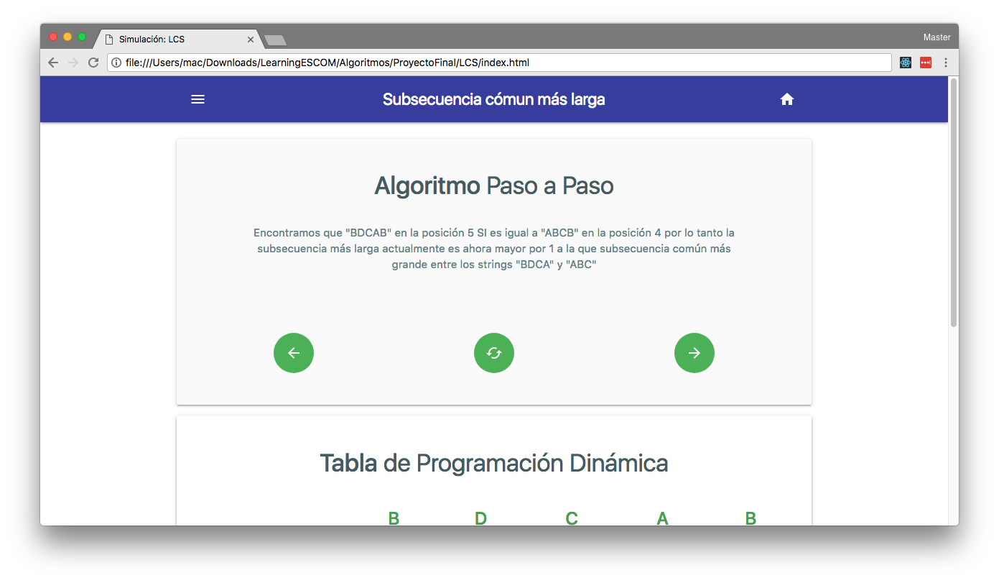
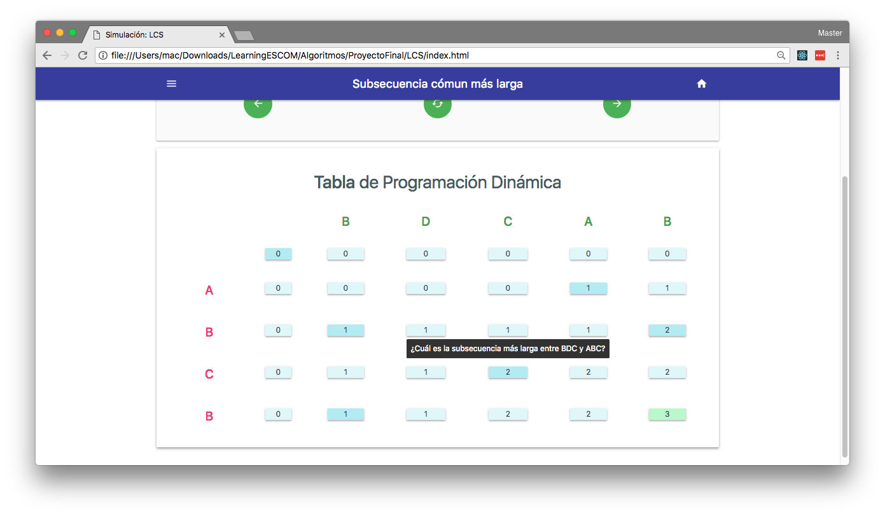
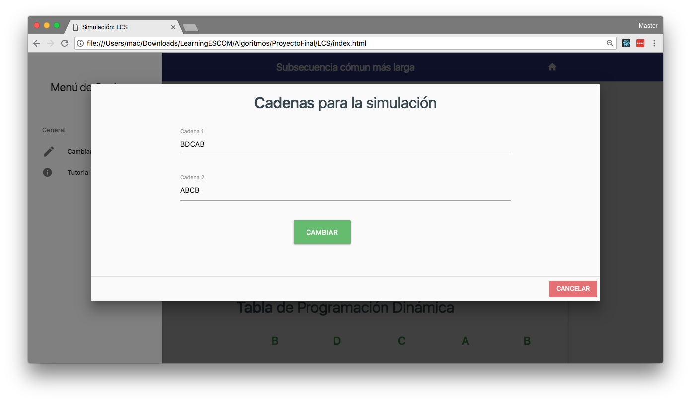
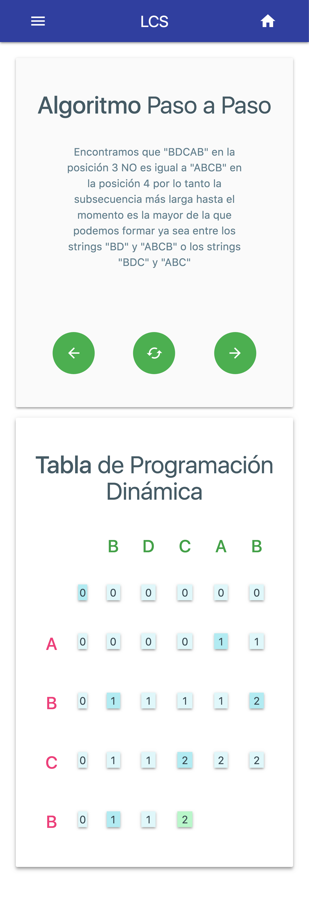
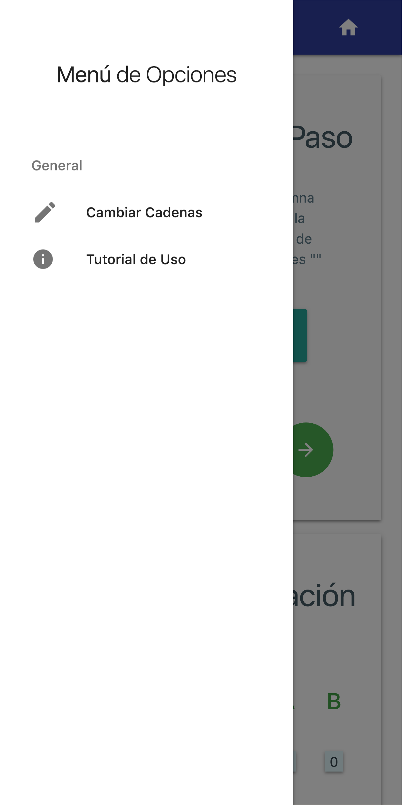
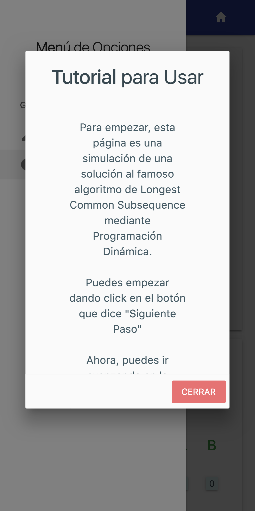

# Longest Common Subsequence

Simulation for Longest Common Subsequence for a school proyect

## Demo

[You can try it for yourself clicking here](http://SoyOscarRH.github.io/LCS)

## Get the Source Code

* [Component Container](Javascript/App.jsx)
* [Simulation Component](Javascript/Simulation.jsx)

## Screenshots

